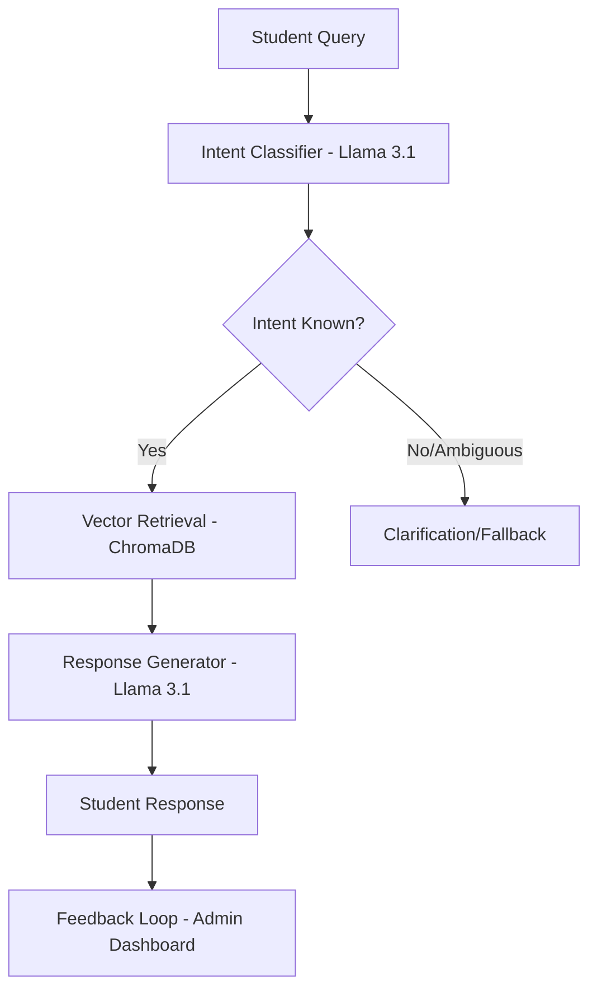

# System Architecture & Knowledge Representation 🏛️

This document outlines the architectural design and knowledge representation strategies used in the AI Campus Assistant, fulfilling the requirements for the FOAI Capstone project.

## 1. System Architecture (Module 1: Core AI Concepts)
The chatbot is designed as an **AI Agent** with a structured perception-action loop:
- **Perception**: Accepts natural language queries from students via the Streamlit interface.
- **Reasoning (Cognitive Layer)**:
    - **Intent Classification**: Uses Llama-3.1 to classify the query into specific domains (Hostel, Finance, etc.).
    - **Retrieval**: Uses a ChromaDB vector store to find the most relevant "Knowledge Atoms" (FAQ pairs).
- **Action**: Generates a grounded, context-aware natural language response and provides user feedback buttons (👍/👎).

### Architecture Diagram

## 2. Knowledge Representation (Module 3: Modern Knowledge Map)
The knowledge base is structured as a **Relational Knowledge Map** connecting various college entities:
- **Entities**: Departments (IT, Academics), Facilities (Hostel, Library, Dining), Financials (Finance), and Career Services (Placements).
- **Links**: Defined via the `topic` metadata in our CSV/Vector Store, allowing for cross-departmental query routing.
- **Data Source**: A high-fidelity dataset of 50+ Q&A pairs (Migrated from Google Sheets).

## 3. NLP & Prompt Engineering (Module 5: NLP Concepts)
We employ advanced prompt engineering techniques to ensure safety and accuracy:
- **System Prompting**: Enforces a "Strict Context" rule where the LLM only answers based on provided RAG chunks.
- **Zero-Shot Classification**: Used in `intent.py` to route queries without needing extensive labeled training data.
- **Sentiment Analysis**: Uses VADER to track the "Perceived Utility" of the agent in the Feedback Dashboard.
